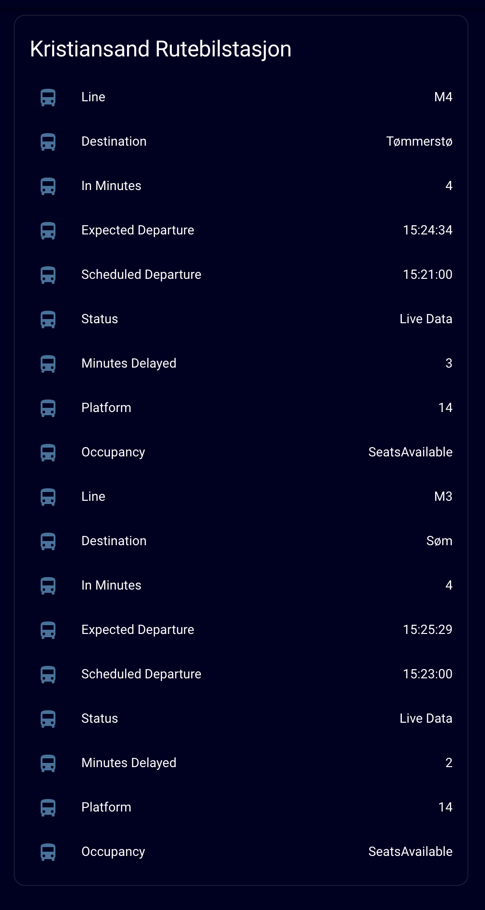

# TravelMagic - Home Assistant

Bus/ public transport departure times in Home Assistant using an unofficial API and the RESTful sensor.

Get the Departure times in Home Assistant for any bus company using the TravelMagic travel planner from DataGrafikk at under the travelplanner.no domain. See https://www.datagrafikk.no/?page_id=2052 for details.

TravelMagic is used by the following public transport providers in Norway, and that I have tested this method with:

- AKT
- AtB 
- Frammr
- Kolumbus
- Reis Nordland

## Find the correct query for the desired departures for your stop

Go to the Departure times for your public transport providers travel planner.
The travel planner is located at:

https://xxx.travelplanner.no/scripts/TravelMagic/TravelMagicWE.dll/?dep1=1&now=1

where xxx is the name of the company/instance, e.g. akt, atb, frammr, kolumbus, and reisnordland. Link for akt:

https://akt.travelplanner.no/scripts/TravelMagic/TravelMagicWE.dll/?dep1=1&now=1

Enter the from stop and apply any filters (if desired) for example specific transport types, lines, or destinations. Make sure Now is checked as the API should always update with the next departures when queried. Search for the next departures from now, so the desired departures will be displayed on screen. If there are multiple stop points or platforms, you may want to select the specific stop points or platform you are interested in.

## Get the URL to get the departures as XML to use in Home Assistant

In the address bar in your web browser replace:

https://xxx.travelplanner.no/scripts/TravelMagic/TravelMagicWE.dll/svar

with:

https://apixxx.travelplanner.no/scripts/TravelMagic/TravelMagicWE.dll/v1DepartureSearchXML

(remember to replace xxx with the company/instance after the word api e.g. aktapi)

Example with AKT:

https://akt.travelplanner.no/scripts/TravelMagic/TravelMagicWE.dll/svar?referrer=&lang=en&dep1=1&theme=&from=Kristiansand+rutebilstasjon+14+%28Kristiansand%29&to=&Time=10%3A45&Date=14.05.2023&now=1&direction=1&search=Search&adv=1&GetTR0=1&through=&throughpause=&changepenalty=1&changepause=0&linjer=&destinations=

becomes:

https://apiakt.travelplanner.no/scripts/TravelMagic/TravelMagicWE.dll/v1DepartureSearchXML?referrer=&lang=en&dep1=1&theme=&from=Kristiansand+rutebilstasjon+14+%28Kristiansand%29&to=&Time=10%3A45&Date=14.05.2023&now=1&direction=1&search=Search&adv=1&GetTR0=1&through=&throughpause=&changepenalty=1&changepause=0&linjer=&destinations=

## Use this URL with the RESTful sensor in Home Assistant

You will get an XML file with the following data (relevant parts)

- `result` element containing the entire result
- `departures` element containing all departure
- `i` element for each departures itself with relevant data as attributes

`i` element attributes
- `tn` Type of transportation
- `d` Scheduled departure time
- `a` Scheduled arrival time
- `hplnr` ID of the stop point / platform
- `platform` Platform number
- `l` Line number
- `nd` Route/destination
- `c` Bus company name
- `cancellation` value indicating the departure is cancelled
- `d2` Expected departure time
- `a2` Expected arrival time
- `monitored` value indicating the departure is being monitored in real time
- `incongestion` value indicating the departure is being in congestion
- `lineref` ID of route
- `occupancy` Indicator of seats available (ManySeatsAvailable, SeatsAvailable, StandingAvailable, Full)

`fromnotes` element inside the `i` element contains additional notes about the departure

`i` element (inside `fromnotes`) for each note for that departure with relevant data as attributes
- `d` Description (or the note itself)
- `st` Type e.g. `situation`
- `sv` Severity e.g. `normal`

See [configuration.yaml](configuration.yaml) for example config

The example gives info for the next `i[0]` and following `i[1]` departure

`sensor`
- `akt_rutebil_next_line` Line number
- `akt_rutebil_next_destination` Route/destination
- `akt_rutebil_next_departure_raw` Expected departure in ISO 8601 format
- `akt_rutebil_next_scheduled_departure_raw` Scheduled departure in ISO 8601 format
- `akt_rutebil_next_departure` Expected departure in format %H:%M:%S
- `akt_rutebil_next_scheduled_departure` Scheduled departure in format %H:%M:%S
- `akt_rutebil_next_status` Status of the departure/live data `Cancelled`, `Congestion`, `Live Data`, or `Timetable` (if nothing else is available)
- `akt_rutebil_next_departure_min` Number of minutes until expected departure (or scheduled departure if expected departure is not available)
- `akt_rutebil_next_delays_min` Number of minutes delayed (0 if expected departure is not available)
- `akt_rutebil_next_platform` Platform number or letter
- `akt_rutebil_next_occupancy` Indicator of seats available (ManySeatsAvailable, SeatsAvailable, StandingAvailable, Full)
- `akt_rutebil_following_xxx` same as above but for the following departure `i[1]` instead of `i[0]`

## Dashboard

After restarting Home Assistant you can create a dashboard with the desired entities. Here is an [example dashboard](dashboard.png) with corresponding [YAML code](dashboard_card.yml).
